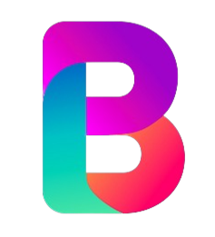
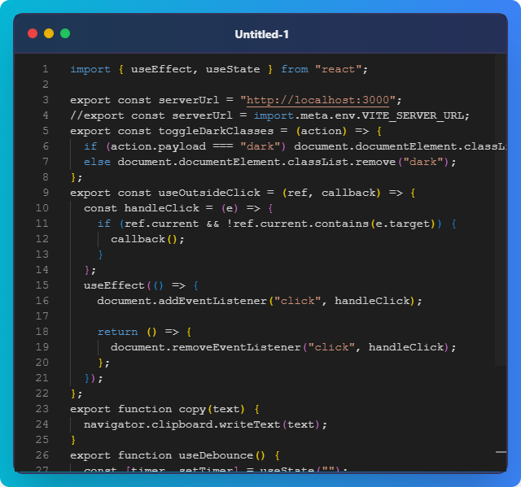

# BlockBeauty 🎨

  
  
  ### Transform Your Code into Beautiful Images

## 🌟 About

BlockBeauty is an elegant tool that transforms your code snippets into beautiful, shareable images. Perfect for:
- Technical documentation
- Social media posts
- Blog articles
- Educational content
- Code presentations

## 🎯 Features

- 🎨 Beautiful syntax highlighting
- 🖼️ Customizable themes
- 📱 Responsive design
- 💫 Modern UI elements
- 🔧 Easy to use

## 📸 Demo

Here's how your code looks when transformed with BlockBeauty:

  

## 🚀 Getting Started

1. Clone the repository
2. Install dependencies
3. Run the application
4. Paste your code
5. Customize the theme
6. Export your beautiful code image

## 🤝 Contributing

Contributions are welcome! Feel free to:
- Report bugs
- Suggest features
- Submit pull requests

## 📄 License

This project is licensed under the MIT License - see the LICENSE file for details.

---

  Made with ❤️ by Mohit Nippanikar

 